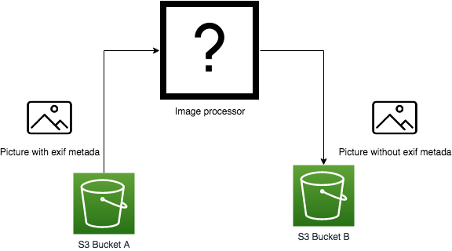
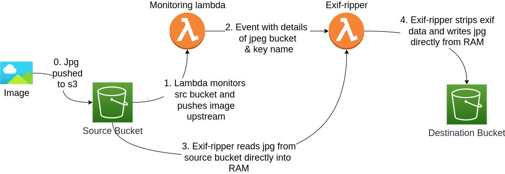
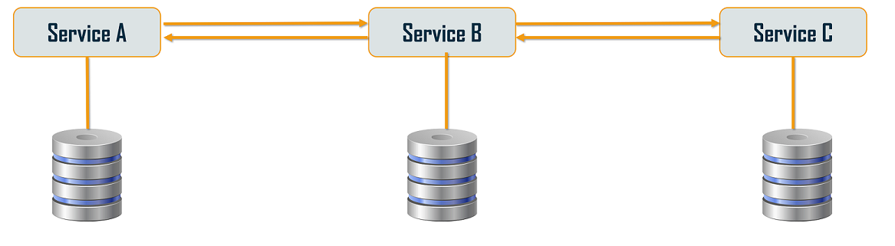

# Genomics Test
**Step 1**
A company allows their users to upload pictures to an S3 bucket. These pictures are always in the .jpg format. The company wants these files to be stripped from any exif metadata before being shown on their website. Pictures are uploaded to an S3 bucket A. Create a system that retrieves .jpg files when they are uploaded to the S3 bucket A, removes any exif metadata, and save them to another S3 bucket B. The path of the files should be the same in buckets A and B.



**Step 2**
To extend this further, we have two users User A and User B. Create IAM users with the following access:
* User A can Read/Write to Bucket A
* User B can Read from Bucket B

## Solution Overview



A natural solution for this problem is to use AWS lambda because this service provides the ability to monitor an s3 bucket and trigger event based messages that can be sent to any arbitrary downstream image processor. Indeed, a whole pipeline of lambda functions can used in the "chain of responsibilty pattern" if desired.



Given the limited time to accomplish this task, a benefit of using serverless is that it is trivial to set up monitoring on a bucket for pushed images because the framework creates the monitoring lambda for us in a few lines of code. When the following code is added to the serverless.yml file, the monitoring lambda pushes an [event](https://www.serverless.com/framework/docs/providers/aws/events/s3) to the custom exif-ripper lambda when a file with the suffix of `.jpg` and a s3 key prefix of `incoming/` is created in the bucket called `mysource-bucket`.

```yaml
functions:
  exif:
    handler: exif.handler
    events:
      - s3:
          bucket: mysource-bucket
          event: s3:ObjectCreated:*
          rules:
            - prefix: uploads/
            - suffix: .jpg
```

The lambda Python3 code for exif-ripper is located in `serverless/exif-ripper/` and it leverages the following libraries to execute the folloowing workflow:
1. [boto3](https://boto3.amazonaws.com/v1/documentation/api/latest/reference/services/s3.html#s3): Read binary image file froom s3 into RAM.
2. [exif](https://pypi.org/project/exif/): Strips any exif data from image
3. Use Boto3 again to write the sanitised file to the destination bucket.potential errors.

### usage
The solution for this problem was solved using the following deployment tools:
1. Terraform - To create common shared resources such as IAM entities & policies, security groups, sqs queues, S3 buckets, databases, etc
2. Serverless (sls) - To deploy lambda functions - lambda functions, API Gateways, step functions, etc

Sls is a better choice to deploy app-specific infratructure because the serverless.yml is tightly coupled to the app code and thus changes can be easily made in a few lines of code compared to the several pages required for Terraform. Additionally, it allows developers to easily modify the infrastructure without asking for DevOps help (as not everyone knows the Terraform DSL). However, It can be a bad idea to allow anyone with access to a Serverless.yml file to deploy whatever they like. Thus, shared-infrastructure that is more stateful is deployed solely by Terraform and ideally this paradigm would be enforced by appropriate IAM permissions. Methods to pass & share data betwwen the two frameworks include the following:

1. Using Tarraform data
2. Reading remote terraform state
3. Writing and coonsuming variables from SSM
4. Using `terraform out` to write out output values to file
5. Using AWS CLI to retrive data

Note that options 3 & 4 are used in this example repo.


Further reading:
[The definitive guide to using Terraform with the Serverless Framework](https://www.serverless.com/blog/definitive-guide-terraform-serverless/)
[Terraform & Serverless framework, a match made in heaven?](https://medium.com/contino-engineering/terraform-serverless-framework-a-match-made-in-heaven-part-i-69af51155e00)
[A Beginner's Guide to Terraform and Serverless](https://blog.scottlogic.com/2020/01/21/beginners-terraform-serverless.html)


#### Serverless Function Overview
Exif-Ripper is a serverless application that attaches an event triggering lambda that monitors a source s3 bucket for the upload of jpg files. When this happens an AWS event invokes a lambda function written in python which strips the exif data from the jpg and writes the "sanitised" jpg to a destination bucket. The lambda function reads & processes the image directly in memory, and thus does not incur write time-penalties by writing the file to scratch.

#### Directory structure
```bash
.
├── Serverless
│   └── exif-ripper
│       ├── config
│       └── test_images
├── Terraform_v1
│   ├── 01_sls_deployment_bucket
│   ├── 02_DEV
│   ├── 03_PROD
│   └── modules
│       ├── exif_ripper_buckets
│       ├── iam_exif_users
│       └── lambda_iam_role_and_policies
└── Terraform_v2
    ├── 00_setup_remote_s3_backend_dev
    ├── 00_setup_remote_s3_backend_prod
    ├── entrypoints
    │   ├── exifripper_buckets
    │   └── sls_deployment_bucket
    ├── envs
    │   ├── dev
    │   └── prod
    └── modules
        ├── exif_ripper_buckets
        └── lambda_iam_role_and_policies
```

The directory structure in this project colocates the infrastructure code with the dev code. An alternative method is accomplished via seperation of the infrastructure code from the dev code into 2 repos:

1. genomics-test (conatinas dev serverless code)
2. genomics-test-infra (contains only terraform code)

**Pros and cons of colocation method:**
The primary benefit of colocation of the terraform code within a serverless project is the ostensible ease of deploying the compressed serverless zip file from a single directory [./xxx_pipeline_create.sh](./xxx_pipeline_create.sh). This makes sense in the context of this example project because there is a requirement to share an uncomplicated code base, and thus this simple method was chosen.

```bash
.
├── genomics-test
    ├── Serverless (code repo)
    ├── Terraform_v1 (terraform repo)
    └── Terraform_v2 (terraform repo)
```

However, if a build server was available, we can escape the mono-repo-centric colocation method because commands can be run outside of the context/restrictions of a single mono-repo/folder.

```bash
.
├── build_agent_dir
    ├── genomics-test  (code repo)
        ├── Serverless
        └── exif-ripper
            ├── config
            └── test_images


### Note infra repo is accesible at another location on the same build server
.
├── /opt/all_terrfarm_cosumers
    └── genomics-test-infra (terraform repo)
         └── terraform_v1

```


There are several benefits in maintaining the infrastucture code in a separate repo:
1. Increased DevOps agility: Application code is subject to a lengthy build & test process during which an artifact is typically created before it can be deployed. If the Terraform code is tightly coupled to the app code via colocation, then even trivial IaC changes such as changing a tag will result in a long delay before (re)deployment can occur which is almost always unacceptable.
2. Dev code repos generally have a more complicated git [branching strategy/structure](https://www.flagship.io/git-branching-strategies/). e.g. GitFlow typically has master, develop, feature, release and hotfix branches. Such complexity is usually unsuitable for terraform IaC which typically only requires master and feature branches because terraform IaC can be designed to consume remote modules. As each remote module inhabits it's own git repo, terraform consumers can be pinned against various tag versions in the modules's master branch; or even be pinned against a particular branch or arbitrary commit hash.

A few methods of organising and deploying the Terraform code are illustrated here. This is a large topic and there is no "one" right answer as it depends on the needs and scale of your orgainisation.

[](https://www.youtube.com/watch?v=Hc79sDi3f0U "Evolving Your Infrastructure with Terraform")

Some of the pertinent questions with regards to how terraform code is structured are:

1. Monolith or multi-repo structure
2.


1. `terraform_v1` - The simplest method
    - Uses local modules that are nested in the root of `terraform_v1`
    - Once the DEV environment is created, it can be copied and pasted to create UAT & DEV envs. Only a few values such as env value (`dev --> uat`) will have to be changed in the new env.
    - A potential disadvantage of this method is that

v2 is a DRY method that also uses a remote s3/dynamodb backend


1.
#### Terraform_v1 does the illustrated
See `xxx_pipeline_create.sh`

1. Creates Serverless deployment bucket. Multiple Serverless projects can be nested in this bucket. This is to avoid the mess of multiple random Serverless buckets being scattered around the root of s3.
2. Creates source & destination s3 buckets for exif image processing
3. Pushes the names of these buckets to SSM
4. Creates a lambda role and policy
5. Creates two users with RO and RW permissions to the buckets as specified in the brief
6. Uses `Terraform output` to write the role arn & the deployment bucket name to the Serverless folder. Both these variables are used to bootstrap serverless and thus cannot be retrived from SSM.

```bash
.
├── 01_sls_deployment_bucket
├── 02_DEV
├── 03_PROD
└── modules
    ├── exif_ripper_buckets
    ├── iam_exif_users
    └── lambda_iam_role_and_policies

```

#### Terraform_v2 does the following:
This version is included to illustrate a method that is more DRY than v1. See `xxx_tfver2_pipeline_create.sh`
1. Creates an s3/dynamodb backend and writes the backend config files to envs folder (00_setup_remote_s3_backend_dev)
2. Creates Serverless deployment bucket. Multiple Serverless projects can be nested in this bucket. This is to avoid the mess of multiple random Serverless buckets being scattered around the root of s3.
3. Creates source & destination s3 buckets for exif image processing
4. Pushes the names of these buckets to SSM
5. Creates a lambda role and policy

```bash
.
├── 00_setup_remote_s3_backend_dev
├── 00_setup_remote_s3_backend_prod
├── entrypoints
│   ├── exifripper_buckets
│   └── sls_deployment_bucket
├── envs
│   ├── dev
│   └── prod
└── modules
    ├── exif_ripper_buckets
    └── lambda_iam_role_and_policies
```


#### The Serverless.yml does the following:
See `serverless/exif-ripper/serverless.yml`
1. Uses the Serverless deployment bucket created by Terraform
2. Fetches ssm variables that have previously been pushed by the Terraform code: (source and destination buckets)
3. Creates the trigger on the source bucket
4. Creates the lambda function (using buckets created by Terraform)

```bash
.
├── Serverless
│   └── exif-ripper
│       ├── config
│       └── test_images
```

## Deployment notes
As s3 buckets must be unique, a random string is used so that multiple people can run the deployment in their own environments at any given time without error.


## Usage
**All instructions are for Ubuntu 20.04 using BASH in a terminal, so your milage may vary if using a different system.**
Several scripts have been included to assist getting this solution deployed. Please treat these scripts as additional documentation and give them a read.

#### Install NVM, Node & Serverless

```bash
cd ~/Downloads
sudo apt install curl
curl https://raw.githubusercontent.com/creationix/nvm/master/install.sh | bash
source ~/.profile
nvm install 14
npm install -g Serverless
cd -
```

#### Please ensure you have exported your aws credentials into your shell
This has been test-deployed into an R&D account using Admin credentials. Try to do the same or use an account with the perms to use lambda, s3, iam, dynamodb, and SSM (syatems manager) at the least.

An Optional method to get a great bash experience via https://github.com/meatware/sys_bashrc

```bash
cd
git clone https://github.com/meatware/sys_bashrc.git
mv .bashrc .your_old_bashrc
ln -fs ~/sys_bashrc/_bashrc ~/.bashrc
source ~/.bashrc
```

#### use awskeys command to easily export aws key as env variables with sys_bashrc

```bash
csp1
awskeys help
awskeys list
awskeys export $YOUR_AWS_PROFILE
```

#### Running Deploy Scripts

```bash
### Install packages
sudo apt install eog jq unzip wget

### Install latest aws cli
curl "https://awscli.amazonaws.com/awscli-exe-linux-x86_64.zip" -o "awscliv2.zip"
unzip awscliv2.zip
sudo ./aws/install

### Install terraform_1.0.6
wget https://releases.hashicorp.com/terraform/1.0.6/terraform_1.0.6_linux_amd64.zip
unzip terraform_1.0.6_linux_amd64.zip
sudo mv terraform /usr/local/bin/terraform_v1.0.6
rm -f terraform_1.0.6_linux_amd64.zip
```

#### Terraform_v1 with Serverless appliaction and users (just dev)
```
### Create stack From repo root
./xxx_pipeline_create.sh terraform_v1.0.6 $YOUR_TERRAFORM_EXEC $RANDOM_STRING

### Test Serverless function
cd serverless/exif-ripper
./00_test_upload_image_2_s3_source.sh default
cd -

### Test user permissions
cd terraform_v1/02_DEV/
./000_extract_user_secrets_from_tfstate.sh
cat ./append_these_perms_to_aws_credentials_file.secrets # <<! take contents of this and pasted into ~/.aws/credentials file

### run user perm tests & check output
./001_test_user_bucket_access.sh
cd -

### DESTROY STACK ONCE FINISHED
./xxx_pipeline_destroy.sh $YOUR_TERRAFORM_EXEC
```
#### Terraform_v2 (NO Serverless or Users) - dev & prod
```
### Create stack From repo root
./xxx_tfver2_pipeline_create.sh $YOUR_TERRAFORM_EXEC $RANDOM_STRING

### Look around and check code!!

### DESTROY STACK ONCE FINISHED
./xxx_tfver2_pipeline_destroy.sh $YOUR_TERRAFORM_EXEC $RANDOM_STRING
```